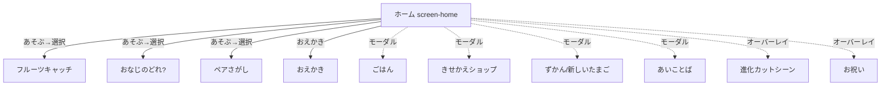

# フロントエンド実装ルール(Flutter)

対象: `app/`(Flutter アプリ)。仕様の正は `docs/game-design.md` と `prototype/mokomon.html`。

## 画面設計

デザインソースはHTMLプロトタイプ(`prototype/mokomon.html`)。CSSの数値(色・角丸・座標・アニメーション時間)をそのまま移植する。デザインとの差分が出る場合は無断でどちらかに寄せず、差分を報告する。

主なデザイントークン(プロトタイプ `:root` に対応):

| 用途 | 値 |
|---|---|
| インク(文字・線) | `#3A3F52` / 補助 `#8A90A8` |
| 背景グラデ | `#BFE9FF → #E8F9EF` |
| 緑ボタン | `#34C98E → #1FAE76` |
| カード角丸 | 24〜28px |
| フォント | M PLUS Rounded 1c(w700/w800、`assets/fonts/`) |

## 画面遷移図



ミニゲーム・おえかきは `Navigator.push`(フル画面)、それ以外は `showDialog`(最大幅360px)。ゲーム/おえかきから戻ったら必ず進化チェック(`evolveCheck`)を行う。

## ディレクトリ構成(クリーンアーキテクチャ)

```
lib/
  models/    ドメイン(純Dart)。GameState・進化判定・あいことばcodec。Flutter非依存
  data/      静的マスタ(species/foods/items)+ SaveStore(shared_preferences)
  logic/     GameController(ChangeNotifier・全状態変更の唯一の入口)+ ミニゲーム純ロジック
  audio/     SoundSynth(WAV実行時合成)+ SfxPlayer(audioplayers)
  screens/   home / catch / puzzle / memory / paint
  widgets/   描画(painter)・演出(particles/confetti/evolution)・モーダル(sheet/dialog)
```

依存方向: `models` ← `logic` ← `screens/widgets`。`models` は Flutter/プラグインを import しない(永続化は `data/save_store.dart`)。

## state管理方針

- ゲーム状態は `GameState`(ドメイン)+ `GameController extends ChangeNotifier`(ユースケース)。UI は `ListenableBuilder` で購読する。外部パッケージ(riverpod等)は使わない。
- 状態変更は必ず GameController のメソッド経由。変更のたびに `notifyListeners()` + `SaveStore.save()`(書き込みは操作のたび、仕様)。
- 画面ローカルの演出状態(アニメーション・タイマー)は各 `StatefulWidget` に閉じる。タイマーは必ず `dispose()` でキャンセルする。
- ミニゲームは純Dartの状態機械(`logic/minigames.dart`)にロジックを分離し、画面は描画と入力変換に徹する。

## 共通コンポーネント(新規作成前にここを確認)

| ウィジェット | 場所 | 用途 |
|---|---|---|
| デザイントークン(`inkColor`/`ink2Color`/各グラデ)・`StatPill`・`CircleIconButton`・`PressableGradient`・`ModalCloseButton`・`MokoModalShell`・`ModalTitle` | widgets/ui_kit.dart | 色・ピル・丸ボタン・押し込みグラデボタン・モーダル外枠の共通部品。**色リテラルや独自ボタンを作る前に必ずここを使う** |
| `MokoModalShell(header:, body:, footer:)` | widgets/ui_kit.dart | 全ダイアログ共通の外枠。`header`/`footer` は常に画面内に固定表示、`body` だけが画面高さ(`MediaQuery`)に応じて必要な時にスクロールする。新しいダイアログは必ずこの3引数の形で組み立て、操作ボタンは `footer` に置く(こどもFB「ボタンまでスクロールせず見えるように」) |
| `CreaturePainter` / `EggPainter` | widgets/ | いきもの・たまご描画(300x300座標系) |
| `CreatureView` | widgets/creature_view.dart | 浮遊・グロー・オーラ・タップアニメ込みの表示 |
| `ParticleField` | widgets/particles.dart | 絵文字パーティクル(上昇/💨ドリフト) |
| `ConfettiBurst` | widgets/confetti.dart | 紙吹雪 |
| `showToast` | widgets/toast.dart | 下部トースト(2.2秒) |
| `showCelebrate` / `StartButton` | widgets/celebrate_overlay.dart | お祝いオーバーレイ・緑大ボタン |
| `GameStartOverlay` / `GameEndOverlay` / `GameOverOverlay` / `GameCountdown` / `BackIconButton` / `GameHeaderBar` / `RoundProgressDots` | widgets/game_overlays.dart | ミニゲーム共通UI。`RoundProgressDots`(ラウンド進捗ドット)は新しいミニゲーム画面でも必ず使う。`GameHeaderBar` は通常 `MinigameScaffold` 経由で使う |
| `MinigameScaffold(title:, topColor:, bottomColor:, children:, overlays:)` | widgets/minigame_scaffold.dart | ミニゲーム画面の外枠(縦グラデ背景+`SafeArea`+ヘッダー行)。`children` がヘッダー下の本体、`overlays` が全面に重ねるオーバーレイ。**新しいミニゲーム画面は `Scaffold` を直接書かずこれを使う**(catch/balloon/whack のアーケード系は `TimedArcadeGameMixin` 側の独自レイアウト) |
| `MistakeGameOverMixin` | screens/mistake_game_over.dart | 正誤判定つきミニゲームの「ミス上限→ゲームオーバー→コインで続行」配線をまとめた mixin。`GameController get controller` と `void resetMistakes()` を実装して使う(例: puzzle/odd_one/order/count screen)。`TimerBagMixin` の上に乗るので `with TimerBagMixin<X>, MistakeGameOverMixin<X>` の順で付ける |
| `TimerBagMixin` | screens/timer_bag.dart | 遅延処理の `Timer` をまとめて持ち `dispose()` で自動キャンセルする mixin。`later(Duration, VoidCallback)` を使う(コールバックは `mounted` が false なら発火しない)。**画面で `Timer` を直接 new しない**(繰り返し発火する `Timer.periodic` のみ例外) |

## UI実装ルール

- タップターゲットは44px以上。テキストは最小限・絵文字アイコンを多用(ターゲットは6〜7歳)。
- 進化関連の数値(xp・しきい値)は**絶対にUIに出さない**(docs/game-design.md §3)。
- モーダルは `ConstrainedBox(maxWidth: 360)`。縦に伸びるものは `SingleChildScrollView` で小画面に耐える。
- 全画面 Stack でオーバーレイを条件表示する場合は `fit: StackFit.expand` を指定する(非positioned子だけになると Stack が収縮するバグを踏んだ)。
- `pumpAndSettle` はテストで使わない(浮遊・グロー等の無限アニメーションがあるため)。固定時間の `pump` を使う。

## エラーメッセージ

すべてひらがな・カタカナで、やさしく、次の行動を示す。例:
- コイン不足 → 「コインが たりないよ! 「あそぶ」で あつめよう🎮」
- あいことば失敗 → 「あいことばが ちがうみたい…🤔」

## ローディング表示

起動時のセーブ読込は `main()` で await(スプラッシュ内)。模様PNGのデコードは非同期だが小さいため専用UIは出さない。

## アクセシビリティ

- 対象年齢の特性上、文字より形・色・音で伝える。効果音はミュート可能(🔊トグル・設定保存)。
- コントラスト: インク `#3A3F52` を白背景で使用(WCAG AA 相当)。
- 縦持ち固定(`portraitUp`)。

## テスト方針(TDD)

- ロジック(GameState / GameController / minigames)は先にテストを書く。UIフローは widget test で固定(たまご孵化・給餌・進化・ショップ・ずかん・あいことば・💨)。
- テストは実行のたび `flutter analyze && flutter test`(75+ケース)。
- 効果音はテスト環境(FLUTTER_TEST)で自動的に無効化される(`audio/sfx_player.dart`)。

## パフォーマンス

- パーティクル・紙吹雪は絵文字 `Text` + 単一 `AnimationController`(画像アセット・per-frame アロケーションなし)。
- フルーツキャッチは `Ticker` 駆動で dt 上限 0.05s。アイテムは画面外で即除去。
- 効果音は初回再生時に WAV を合成しメモリキャッシュ(`SoundSynth`)。アセット不要。
- 模様(お絵かき)は保存時のみ PNG エンコードし、表示は `ui.Image` をキャッシュ。
